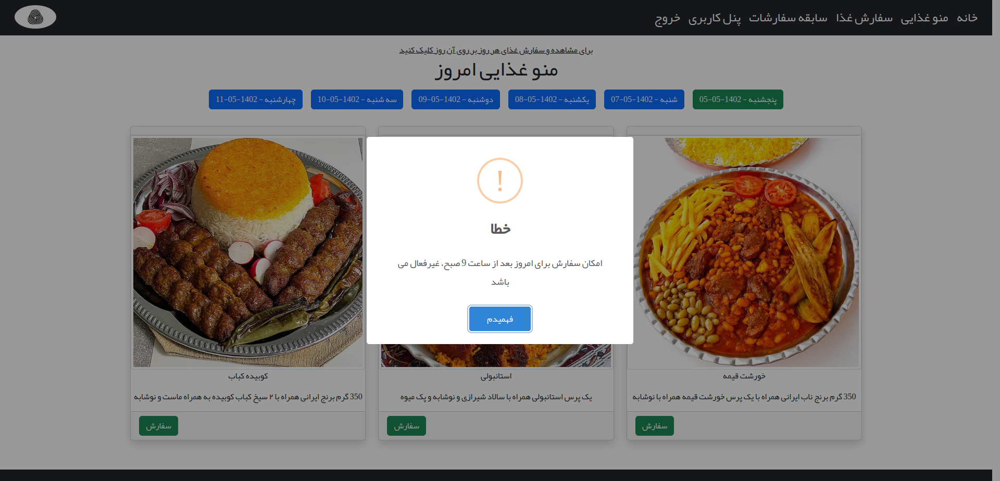
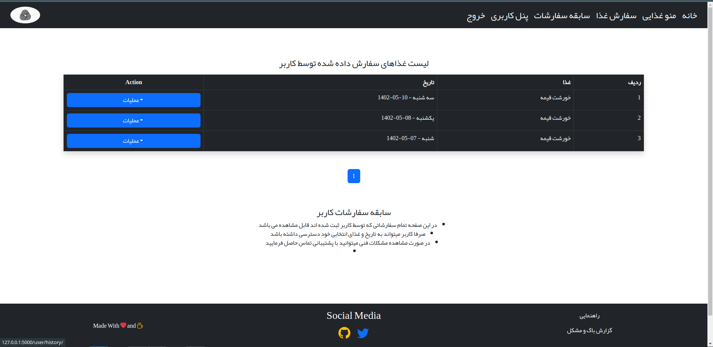

# اتوماسیون تغذیه کارمندان
### سیستم اتوماسیون تغذیه یا سلف سرویس در واقع یک نوع از سیستم جامع تحویل غذا است که پرسنل و دانشجویان می توانند به منظور سفارش و صرف غذا در سازمان های دولتی و خصوصی و همچنین دانشگاه ها از این سیستم استفاده کنند.
  

tech Stack:
      
      python3
      Flask
        Flask-Captcha2
        Flask-Sqlalchemy
        Flask-Session
        Flask-Wtf
        Flask-Migrate
        Flask-RQ

      Redis 
      Mysql
      
      Html
      Css
          Bootstrap 5.2
          Bootstrap Icon 1.10
      Javascript
        Chart js
        Moment js
        SweetAlert2 js
        

## Configurations and Settings:
- before starting the app, you should do some steps
- first create your own config file with below command:
 
      cp .env.sample .env
- then open the .env file and fill in all the required fields 
- the required files include the database configuration, admin configuration, and SecretKey
- then init and migrate db with below commands:
        
        # remember at this poit you should create a database 
        # and also put database name in .env file before running below commands
          
        flask db init
        flask db migrate
        flask db upgrade
- after these steps you have to run below commands for SMS_IR config file

        cp FoodyConfig/StaticConfig/SMS_IR_Config.py.sample FoodyConfig/StaticConfig/SMS_IR_Config.py
- and then open FoodyConfig/StaticConfig/SMS_IR_Config.py and replace your template id (FROM SMS_IR) with fake one in file
- to change the sections, simply open FoodyConfig/StaticConfig/Sections.py and replace all Sections with your own Company Sections (this required a little bit knowledge of Python Dict )
- simply run the following command :

        flask run [--port int:portNumber] [--debug] [ --reload ] [-- with-threads OR --without-threads]
        or 
        python app.py

## دمو تصویری
### Admin Panel

### User Panel

#  کاملا ریسپانسیو با تمام دستگاه ها

