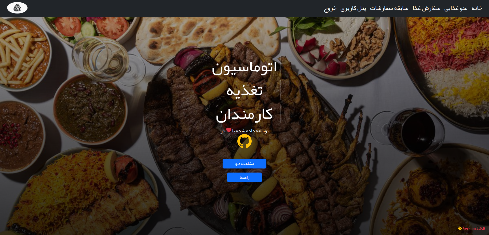
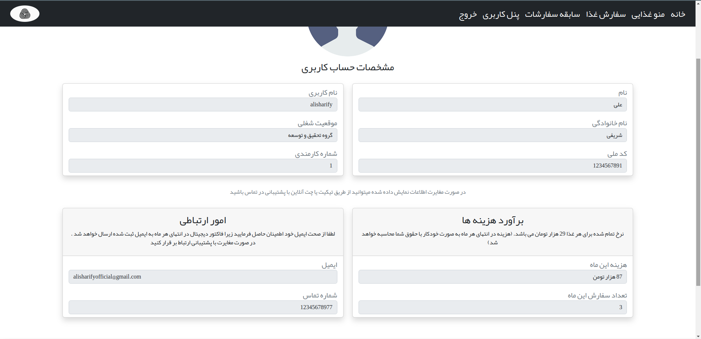
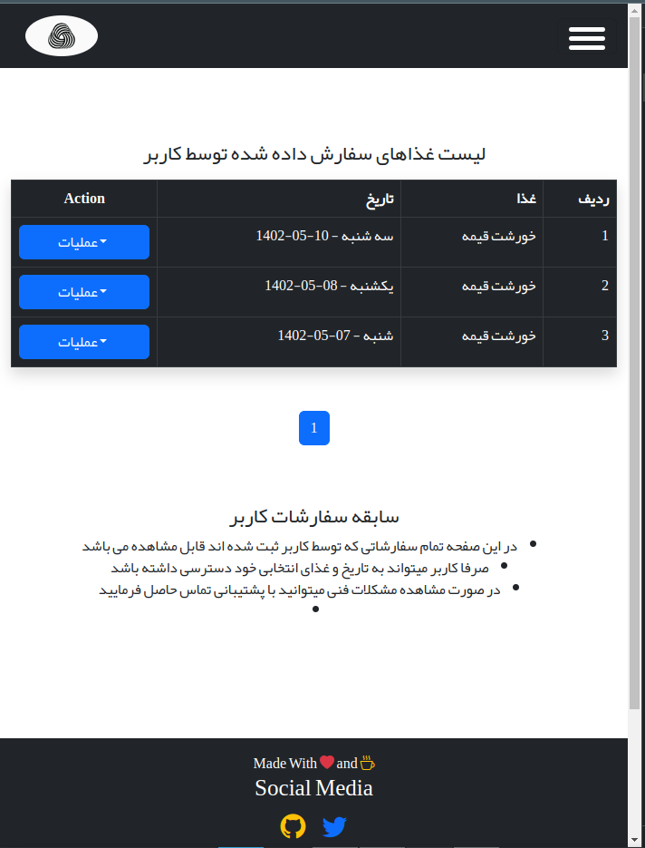
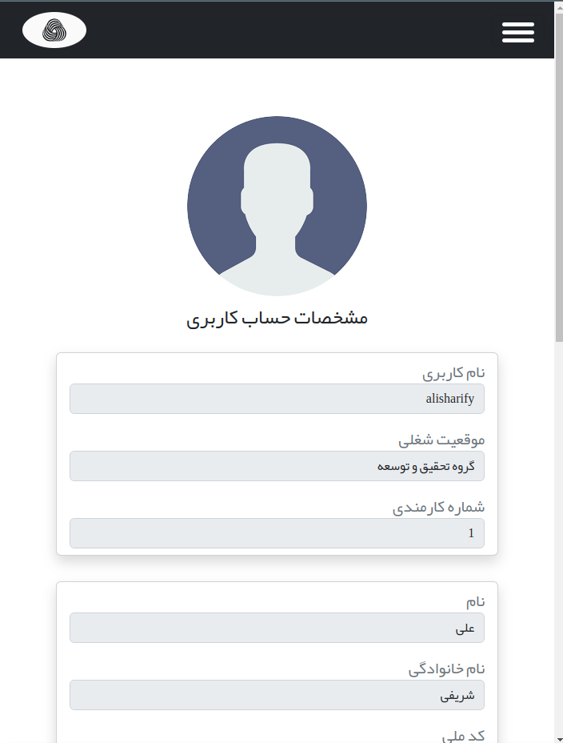

# اتوماسیون تغذیه کارمندان
### سیستم اتوماسیون تغذیه یا سلف سرویس در واقع یک نوع از سیستم جامع تحویل غذا است که پرسنل و دانشجویان می توانند به منظور سفارش و صرف غذا در سازمان های دولتی و خصوصی و همچنین دانشگاه ها از این سیستم استفاده کنند.
  

## دمو تصویری

#  کاملا ریسپانسیو با تمام دستگاه ها

